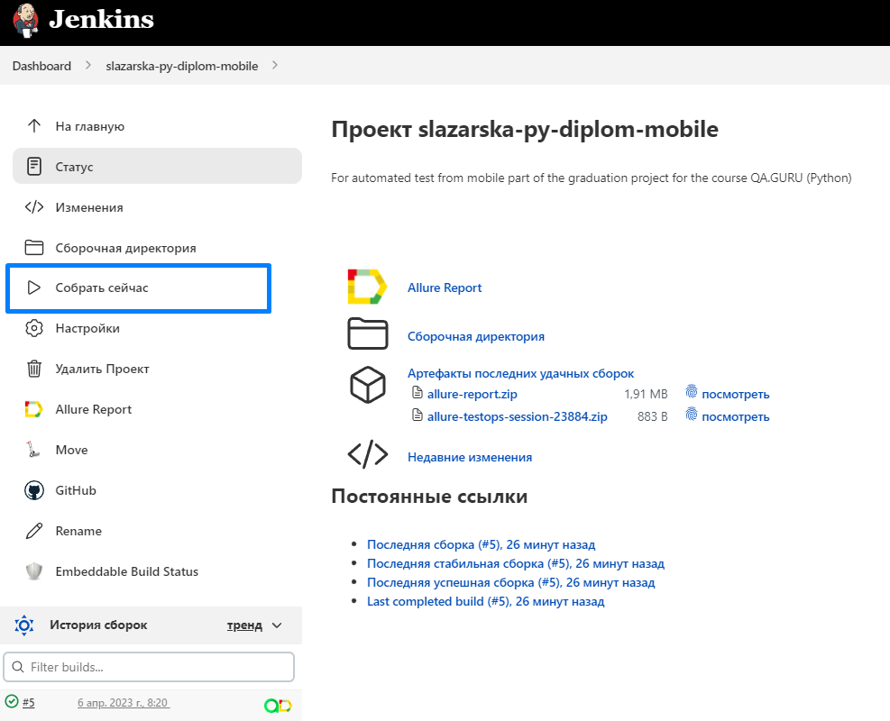
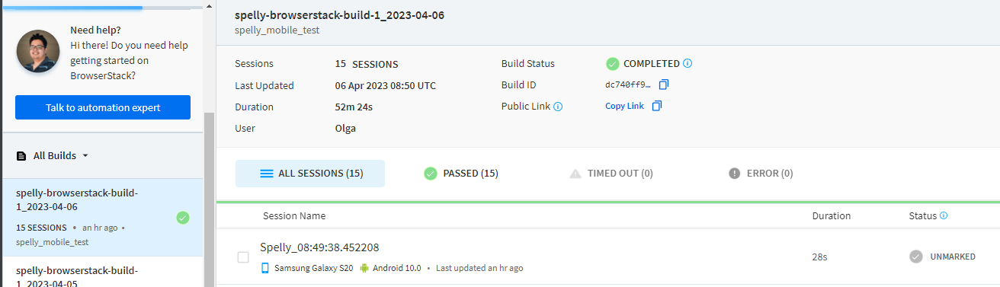
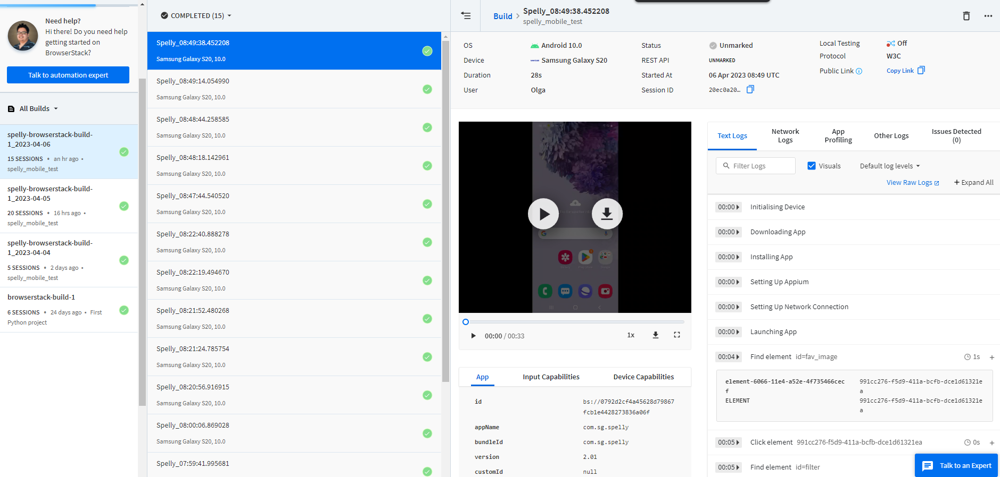
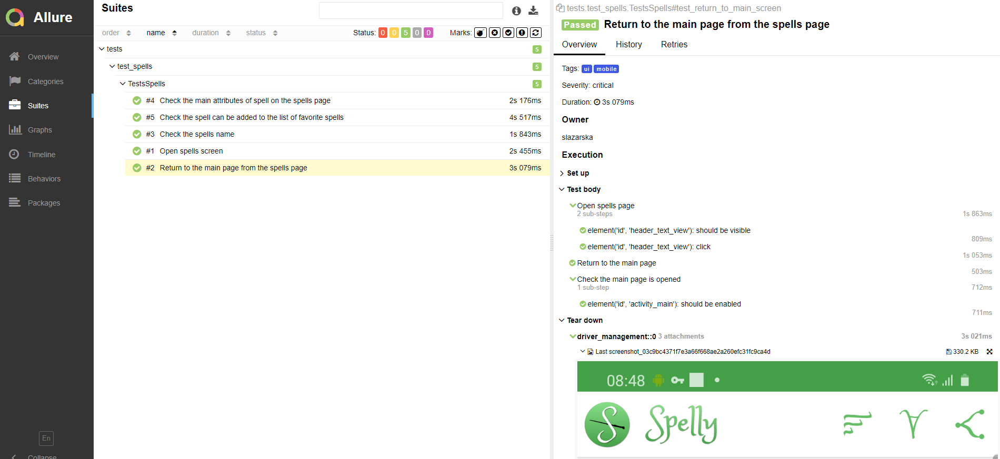
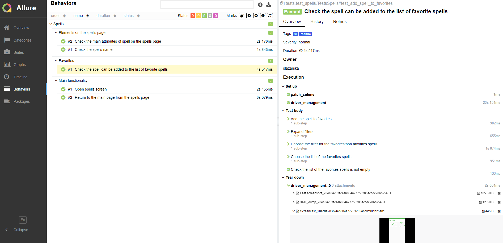
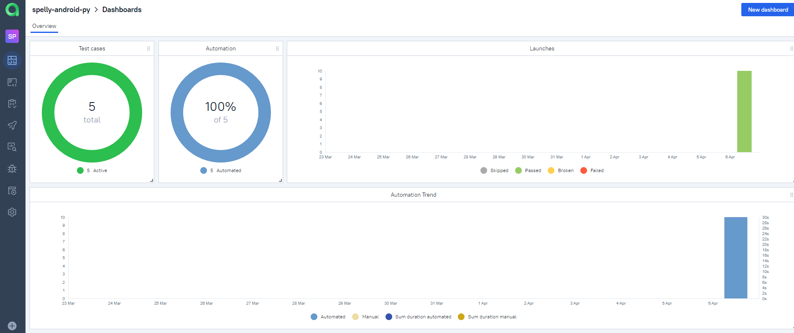
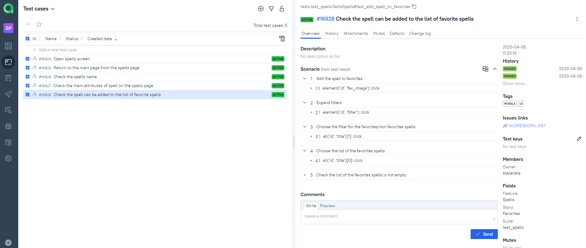
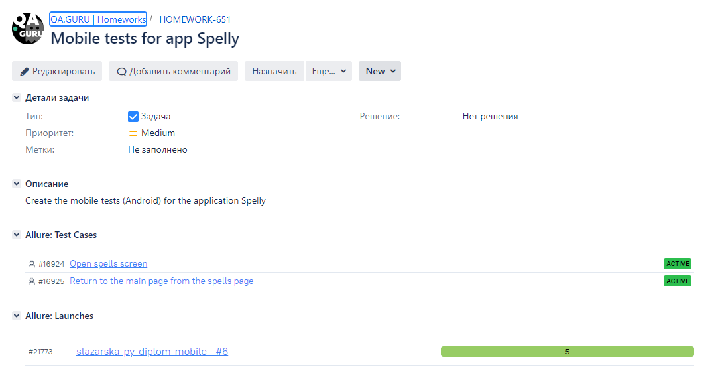
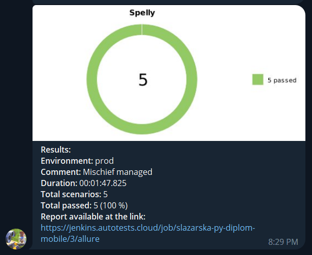
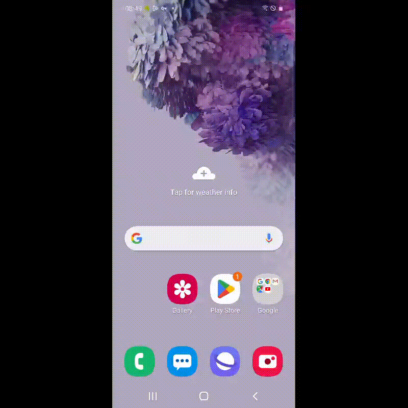

# Automated Android tests for the mobile application Spelly


## Content:
- [Technology Stack](#technology-stack)
- [In a nutshell about the project](#in-a-nutshell-about-the-project)
- [Checks are implemented](#checks-are-implemented)
- Tests launch:
  - [Jenkins](#remote-launch-via-jenkins)
  - [Local](#local-launch )
- Integrations & Reporst:
  - [Allure Report](#allure-report-is-connected-to-build-reports) 
  - [Allure TestOps](#allure-testOps-is-used-as-a-test-management-system)
  - [Jira](#integration-Jira-with-allure-testOps-is-configured)
  - [Telegram](#telegram-notifications-are-configured)
- [Video](#added-video-into-tests-run-test-run-video-example)

## Technology Stack:
<div>


</div>

## In a nutshell about the project
- [x] Patterns `Page Object` and `Application Manager`
- [x] Self-documenting code
- [x] Custom local launch using `Android Studio` or `Browserstack`
- [x] Remote launch using `Jenkins` and `Browserstack`
- [x] `Allure Reports` with attachments: logs, screenshots, videos
- [x] Integration with `Allure TestOps`
- [x] Integration with `Jira`
- [x] Notifications about test launch and test results via `Telegram`

## Checks are implemented:

- [X] - Opening the spells page
- [X] - Check the name of the spell
- [X] - Check the attributes on the spells page
- [X] - Adding the spell to the favorite spells list

## Remote launch via [Jenkins](https://jenkins.autotests.cloud/job/slazarska-py-diplom-mobile/)

To run tests from Jenkins:
1. Click the "Build Now" button.


## Local launch 

To run locally:
1. Clone the repository
2. Install Poetry (`poetry install`)
3. Open the project in PyCharm, add Python Interpreter
4. Launch [BrowserStack](https://app-automate.browserstack.com/)
   - Sign up and get credentials (username, access key), upload apk from resources folder to get app id
5. Install Android Studio and Appium
   - Start Appium Server
   - Run device emulator via Virtual Device Manager in Android Studio
6. Create `env` files in the project folder according to the samples:
    - `config.browserstack.env` 
    - `config.local.env`
7. Run the tests in PyCharm or on the command line:
```bash
pytest . --alluredir allure-results/
```
## Build parameters:

```bash
pytest . --alluredir allure-results/
```
> In terminal 
> - for local run with device emulator:
```bash
env -S "context=local" pytest . --alluredir allure-results/
```
> - for remote run in BrowserStack:
```bash
env -S "context=browserstack" pytest . --alluredir allure-results/
```

> Or in the `config.py` file, change the value of `EnvContext`:
> - `local` — run locally with device emulator
> - `browserstack` — run in BrowserStack

8. Check launch status in BrowserStack



## Allure Report is connected to build reports:



> If running locally, to check the Allure Report, enter on the command line:
```bash
allure serve .\allure-results
```

## Allure TestOps is used as a Test Management System:


<br><br>
## Integration Jira with Allure TestOps is configured:

<br><br>
## Telegram notifications are configured:

<br><br>
## Added video into tests run. Test run video example:

<br><br>
Thanks :pray:<br/>
:green_heart: <a target="_blank" href="https://qa.guru">QA.GURU</a><br/>
:purple_heart: <a target="_blank" href="https://sites.google.com/view/qasisters/">QA Sisters</a><br/>